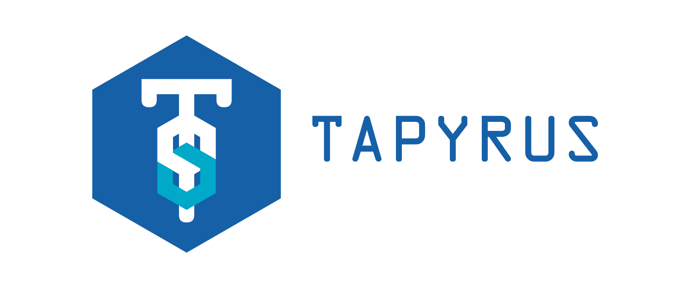

Tapyrus Core 
=====================================

What is Tapyrus?
----------------

Tapyrus is a blockchain that has been forked from Bitcoin Core, and solves the governance issues.
Bitcoin uses Proof of Work as a consensus algorithm, but Tapyrus creates a block (ie, approves a transaction)
with multiple signatures from the Signer group which consists of industry stakeholders.
Therefore, transactions on the blockchain are stably approved, and finality is given at the time of approval.
Anyone can join the Tapyrus network, and anyone can access the public ledger and create and broadcast transactions freely.

Tapyrus has the following additions and changes to the Bitcoin implementation.:

* [Support Schnorr Signature](/doc/tapyrus/schnorr_signature.md)
* [Fix transaction malleability](/doc/tapyrus/fix_transaction_malleability.md)
that enables off-chain payments using the Payment Channel on Tapyrus.
* [Support Oracle contract](/doc/tapyrus/script.md)
* [Block generation with multiple signatures](/doc/tapyrus/signedblocks.md)
* [WIP]Support native colored coin protocol
* Support aggregated/threshold signatures: In tapyrus singer network, each signer execute a threshold signature scheme
based on [provably secure distributed schnorr signatures and a {t,n} threshold scheme](http://cacr.uwaterloo.ca/techreports/2001/corr2001-13.ps)
 and generates a valid signature for the aggregate public key required for block approval.
* [WIP]Support covenants
* [WIP]Support Network Update scheme

Tapyrus consists of the following software:

* [Tapyrus Core](https://github.com/chaintope/tapyrus-core): Tapyrus full node implementation.
* [Tapyrus Signer](https://github.com/chaintope/tapyrus-signer): A network of signers that collects Unapproved transactions from the Tapyrus network and creates a block.
* [Tapyrus Seeder](https://github.com/chaintope/tapyrus-seeder): DNS seeder for configuring Tapyrus network.
* [Tapyrus Faucet](https://github.com/chaintope/tapyrus-faucet): Faucet for Tapyrus testnet.
* [[WIP]Tapyrus SPV](https://github.com/chaintope/tapyrus-spv): A lightweight client implementation for Tapyrus blockchain.
* [[WIP]Tapyrus Explorer](https://github.com/chaintope/tapyrus-explorer): Tapyrus blockchain explorer.
* [Electrs Tapyrus](https://github.com/chaintope/electrs-tapyrus): Tapyrus blockchain index server.

See [Getting Started document](/doc/tapyrus/getting_started.md) for how to install and run tapyrus.

Run as a Docker container?
---------------------------

See [Docker Image for Tapyrus Core](/doc/docker_image.md).

License
-------

Tapyrus Core is released under the terms of the MIT license. See [COPYING](COPYING) for more
information or see https://opensource.org/licenses/MIT.

