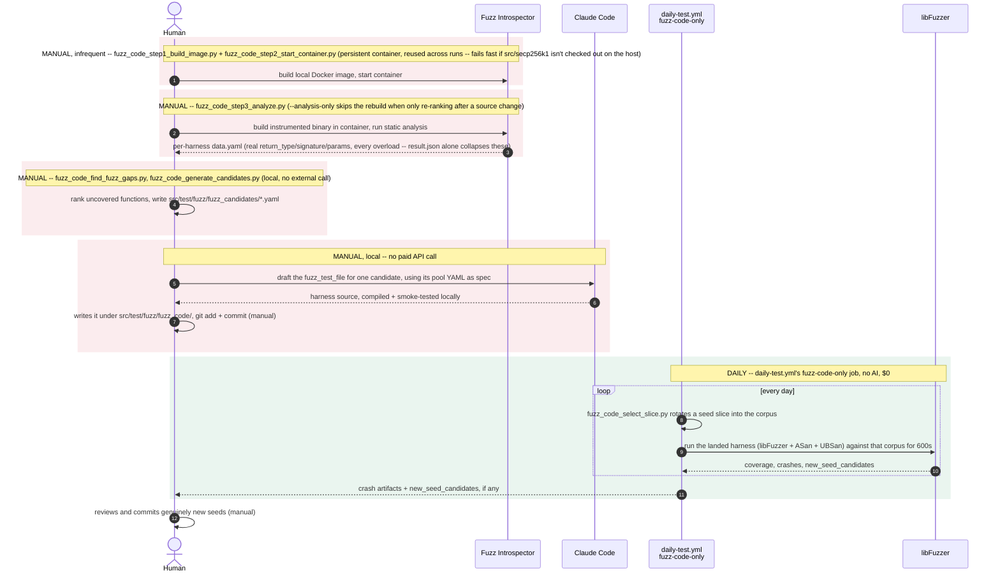
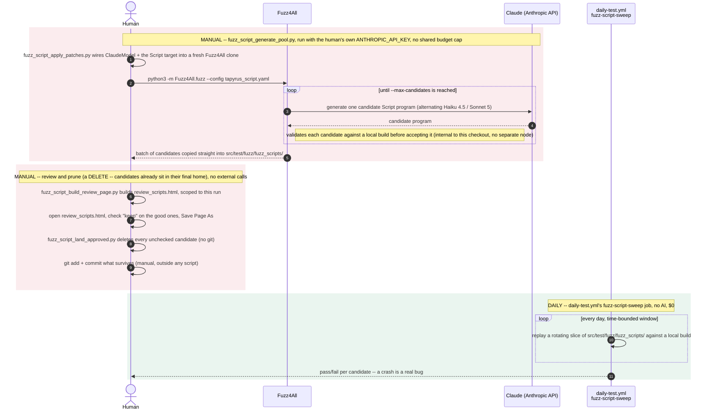

# Fuzz pipeline

Two pipelines grow this repo's fuzz coverage: one finds functions with no
fuzz-target coverage (Fuzz Introspector) and drafts a `fuzz_test_file`
for one locally via Claude Code -- no paid API call anywhere in this
pipeline, since the team decided to skip OSS-Fuzz-Gen's Vertex AI
drafting entirely. The other (fuzz_script) generates candidate Tapyrus
Script programs via Fuzz4All calling Claude over the real Anthropic
API, run locally by whoever wants to grow the pool, using their own API
key -- there's no shared budget cap or spend tracking, just a per-run
`--max-candidates` bound.

Every node in the diagrams below is a real external library or service
(Fuzz Introspector, Claude Code, Fuzz4All, Claude via the Anthropic API,
libFuzzer) -- no tapyrus binary or in-repo library gets its own node.
Local orchestration is drawn as the human's (or CI's) own actions,
labeled with the actual script that runs it.

Mermaid's `sequenceDiagram` grammar has no `click`/hyperlink directive
(that's a flowchart/class/state-diagram feature only -- confirmed by
trying it: `mermaid.parse()` rejects `click` inside a `sequenceDiagram`
block), so a script name inside either diagram below can't be a link. The
[Scripts at a glance](#scripts-at-a-glance) table underneath does the
same job instead: every script name there is a real relative link to
that file in this checkout.

## Pipeline A -- fuzz_code

[`oss-fuzz/drafting/`](oss-fuzz/drafting/) + [`oss-fuzz/project/`](oss-fuzz/project/) + [`fuzz-introspector/`](fuzz-introspector/)

Nothing in this pipeline costs money: gap analysis is local Docker/static
analysis, and drafting is Claude Code writing the harness directly,
compiled and smoke-tested before it's committed. Once a harness is
landed, `fuzz-code-only` runs it daily and free forever -- libFuzzer's
own coverage-guided mutation supplies different inputs every run, not a
further drafting session.

## Pipeline B -- fuzz_script (Fuzz4All)

[`fuzz4all/`](fuzz4all/)

No mutation engine here -- unlike pipeline A, every input this pipeline
ever tests came from an LLM call, which is exactly why the daily sweep
replays a rotating window of an already-committed pool instead of
generating anything itself. Unlike pipeline A, this one does spend real
money on every run -- there's just no script-enforced cap on it anymore;
whoever runs `fuzz_script_generate_pool.py` watches their own Anthropic
account.

## Scripts at a glance

| Script | Pipeline | Cadence | What it does |
| --- | --- | --- | --- |
| [`fuzz_code_step1_build_image.py`](fuzz-introspector/fuzz_code_step1_build_image.py) | fuzz_code | manual, infrequent | Builds the reusable local Docker image (pinned base-image digest) |
| [`fuzz_code_step2_start_container.py`](fuzz-introspector/fuzz_code_step2_start_container.py) | fuzz_code | manual, infrequent | Starts/stops a persistent container from that image, bind-mounting the checkout; fails fast if src/secp256k1 isn't initialized on the host |
| [`fuzz_code_step3_analyze.py`](fuzz-introspector/fuzz_code_step3_analyze.py) | fuzz_code | manual, frequent | Runs the coverage build + Fuzz Introspector analysis inside the running container, then `fuzz_code_find_fuzz_gaps.py` -- `--analysis-only` skips the rebuild when only re-ranking after a source change |
| [`fuzz_code_find_fuzz_gaps.py`](fuzz-introspector/fuzz_code_find_fuzz_gaps.py) | fuzz_code | manual | Parses the per-harness data.yaml into a ranked candidate list, with real return_type/signature/params and every overload included |
| [`fuzz_code_generate_candidates.py`](oss-fuzz/drafting/fuzz_code_generate_candidates.py) | fuzz_code | manual | Turns each candidate into a spec YAML under `src/test/fuzz/fuzz_candidates/` for Claude Code to draft a harness from |
| [`fuzz_code_select_slice.py`](../../src/test/fuzz/fuzz_seed_pool/fuzz_code_select_slice.py) | fuzz_code | daily | Rotates a seed slice into each libFuzzer target's corpus every run |
| [`fuzz_script_generate_pool.py`](fuzz4all/fuzz_script_generate_pool.py) | fuzz_script | manual | Orchestrates a Fuzz4All + Claude run to grow the Script candidate pool, using the runner's own API key |
| [`fuzz_script_apply_patches.py`](fuzz4all/fuzz_script_apply_patches.py) | fuzz_script | manual | Wires ClaudeModel + the Script target into a fresh Fuzz4All clone (applied automatically by the script above) |
| [`fuzz_script_build_review_page.py`](fuzz4all/fuzz_script_build_review_page.py) | fuzz_script | manual | Builds review_scripts.html scoped to one run's new candidates (applied automatically by the generator above) |
| [`fuzz_script_land_approved.py`](fuzz4all/fuzz_script_land_approved.py) | fuzz_script | manual | Prunes (deletes) the unchecked rows of a saved review_scripts.html -- no git commands |
| [`daily-test.yml`](../../.github/workflows/daily-test.yml): `fuzz-code-only` | fuzz_code | daily | Runs libFuzzer (+ASan/UBSan) against every landed harness -- no AI |
| [`daily-test.yml`](../../.github/workflows/daily-test.yml): `fuzz-script-sweep` | fuzz_script | daily | Replays a rotating window of the committed Script pool -- no AI |

**fuzz_code drafts locally; fuzz_script still calls a paid API.**
OSS-Fuzz-Gen's Vertex AI drafting path is gone entirely: every
`fuzz_test_file` is now drafted by asking Claude Code to write it
directly, compiled/smoke-tested locally before it's committed, at no
cost beyond whatever Claude Code session does the drafting. fuzz_script
is different: `fuzz_script_generate_pool.py` still makes real Anthropic
API calls through Fuzz4All to generate Script programs -- there used to
be a shared `fuzz_spend_ledger.py` cap across both pipelines; that's
gone now too, so this is run locally with the operator's own API key and
no script-enforced budget, just `--max-candidates` bounding a single
run.

**Python + asyncio, not bash.** `fuzz_code_step1_build_image.py`/
`fuzz_code_step2_start_container.py`/`fuzz_code_step3_analyze.py` are
Python, not shell -- letting `step2`'s persistent-container management
and `step3`'s in-container analysis share real code (subprocess
wrappers, error handling) instead of duplicating it across `.sh` scripts.

**Only fuzz_script still has a review page.** fuzz_code's Claude Code
drafting produces one harness per request, written straight under
`src/test/fuzz/fuzz_code/` -- nothing to review in bulk. fuzz_script's
generator instead produces a whole batch per run, so
`review_scripts_<run-prefix>.html` + `fuzz_script_land_approved.py` are
still how a human prunes that batch down to what's worth keeping before
committing.
