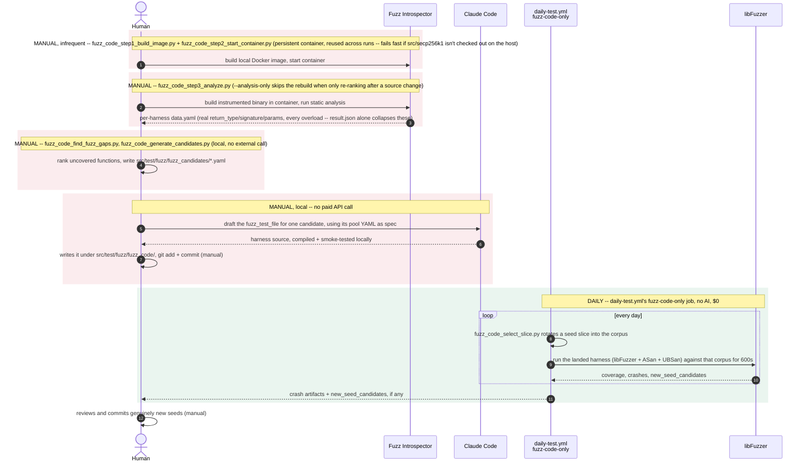
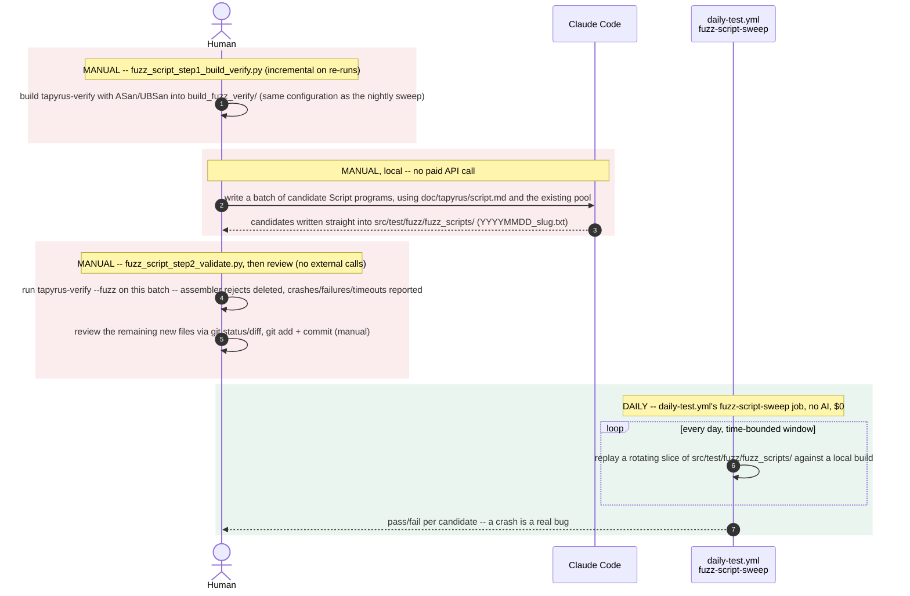

# Fuzz pipeline

Two pipelines grow this repo's fuzz coverage: one finds functions with no
fuzz-target coverage (Fuzz Introspector) and drafts a `fuzz_test_file`
for one locally via Claude Code. The other (fuzz_script) has Claude Code
write candidate Tapyrus Script programs locally, validated against a
local sanitizer build of `tapyrus-verify`. Neither makes a paid API
call: the team decided to skip both OSS-Fuzz-Gen's Vertex AI drafting
and Fuzz4All's Anthropic API generation, so there is no API key, spend
tracking or budget cap anywhere in either pipeline.

Every node in the diagrams below is a real external library or service
(Fuzz Introspector, Claude Code, libFuzzer) -- no tapyrus binary or in-repo library gets its own node.
Local orchestration is drawn as the human's (or CI's) own actions,
labeled with the actual script that runs it.

Mermaid's `sequenceDiagram` grammar has no `click`/hyperlink directive
(that's a flowchart/class/state-diagram feature only -- confirmed by
trying it: `mermaid.parse()` rejects `click` inside a `sequenceDiagram`
block), so a script name inside either diagram below can't be a link. The
[Scripts at a glance](#scripts-at-a-glance) table underneath does the
same job instead: every script name there is a real relative link to
that file in this checkout.

## Pipeline A -- fuzz_code

[`oss-fuzz/drafting/`](oss-fuzz/drafting/) + [`oss-fuzz/project/`](oss-fuzz/project/) + [`fuzz-introspector/`](fuzz-introspector/)

Nothing in this pipeline costs money: gap analysis is local Docker/static
analysis, and drafting is Claude Code writing the harness directly,
compiled and smoke-tested before it's committed. Once a harness is
landed, `fuzz-code-only` runs it daily and free forever -- libFuzzer's
own coverage-guided mutation supplies different inputs every run, not a
further drafting session.

## Pipeline B -- fuzz_script

[`fuzz_script/`](fuzz_script/)

No mutation engine here -- unlike pipeline A, every input this pipeline
ever tests was written by Claude Code, which is exactly why the daily
sweep replays a rotating window of an already-committed pool instead of
generating anything itself. Like pipeline A, nothing here costs money
beyond the Claude Code session doing the generation.

## Scripts at a glance

| Script | Pipeline | Cadence | What it does |
| --- | --- | --- | --- |
| [`fuzz_code_step1_build_image.py`](fuzz-introspector/fuzz_code_step1_build_image.py) | fuzz_code | manual, infrequent | Builds the reusable local Docker image (pinned base-image digest) |
| [`fuzz_code_step2_start_container.py`](fuzz-introspector/fuzz_code_step2_start_container.py) | fuzz_code | manual, infrequent | Starts/stops a persistent container from that image, bind-mounting the checkout; fails fast if src/secp256k1 isn't initialized on the host |
| [`fuzz_code_step3_analyze.py`](fuzz-introspector/fuzz_code_step3_analyze.py) | fuzz_code | manual, frequent | Runs the coverage build + Fuzz Introspector analysis inside the running container, then `fuzz_code_find_fuzz_gaps.py` -- `--analysis-only` skips the rebuild when only re-ranking after a source change |
| [`fuzz_code_find_fuzz_gaps.py`](fuzz-introspector/fuzz_code_find_fuzz_gaps.py) | fuzz_code | manual | Parses the per-harness data.yaml into a ranked candidate list, with real return_type/signature/params and every overload included |
| [`fuzz_code_generate_candidates.py`](oss-fuzz/drafting/fuzz_code_generate_candidates.py) | fuzz_code | manual | Turns each candidate into a spec YAML under `src/test/fuzz/fuzz_candidates/` for Claude Code to draft a harness from |
| [`fuzz_code_select_slice.py`](../../src/test/fuzz/fuzz_seed_pool/fuzz_code_select_slice.py) | fuzz_code | daily | Rotates a seed slice into each libFuzzer target's corpus every run |
| [`fuzz_script_step1_build_verify.py`](fuzz_script/fuzz_script_step1_build_verify.py) | fuzz_script | manual | Builds `tapyrus-verify` with ASan/UBSan into `build_fuzz_verify/`, the same configuration the nightly sweep uses |
| [`fuzz_script_step2_validate.py`](fuzz_script/fuzz_script_step2_validate.py) | fuzz_script | manual | Runs `tapyrus-verify --fuzz` on one batch of new candidates; deletes assembler rejects, reports crashes/failures/timeouts -- no git commands |
| [`daily-test.yml`](../../.github/workflows/daily-test.yml): `fuzz-code-only` | fuzz_code | daily | Runs libFuzzer (+ASan/UBSan) against every landed harness -- no AI |
| [`daily-test.yml`](../../.github/workflows/daily-test.yml): `fuzz-script-sweep` | fuzz_script | daily | Replays a rotating window of the committed Script pool -- no AI |

**Both pipelines generate locally, via Claude Code.** OSS-Fuzz-Gen's
Vertex AI drafting path and fuzz_script's Fuzz4All + Anthropic API
generator are both gone: every `fuzz_test_file` and every Script
candidate is written by asking Claude Code directly, then compiled or
validated locally before it's committed, at no cost beyond the Claude
Code session doing the work. Fuzz4All couldn't simply be pointed at
Claude Code instead -- its generation loop needs a model it can call
programmatically once per candidate -- see
[`fuzz_script/README.md`](fuzz_script/README.md#why-fuzz4all-was-removed).

**Python + asyncio, not bash.** `fuzz_code_step1_build_image.py`/
`fuzz_code_step2_start_container.py`/`fuzz_code_step3_analyze.py` and
`fuzz_script_step1_build_verify.py` are Python, not shell -- letting
`step2`'s persistent-container management and `step3`'s in-container
analysis share real code (subprocess wrappers, error handling) instead
of duplicating it across `.sh` scripts.

**No review pages.** Both pipelines generate inside an interactive
Claude Code session, so their output is reviewed there and as ordinary
uncommitted files (`git status`/`git diff`) -- fuzz_code one harness per
request under `src/test/fuzz/fuzz_code/`, fuzz_script one batch under
`src/test/fuzz/fuzz_scripts/`, already filtered by
`fuzz_script_step2_validate.py`. Nothing needs a separate HTML review
page or landing script.
