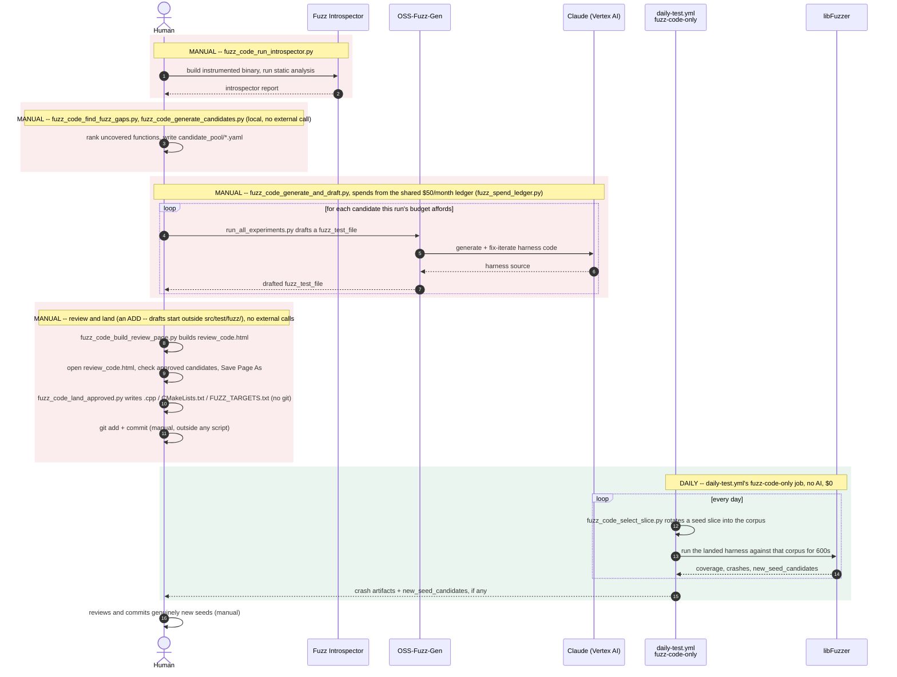
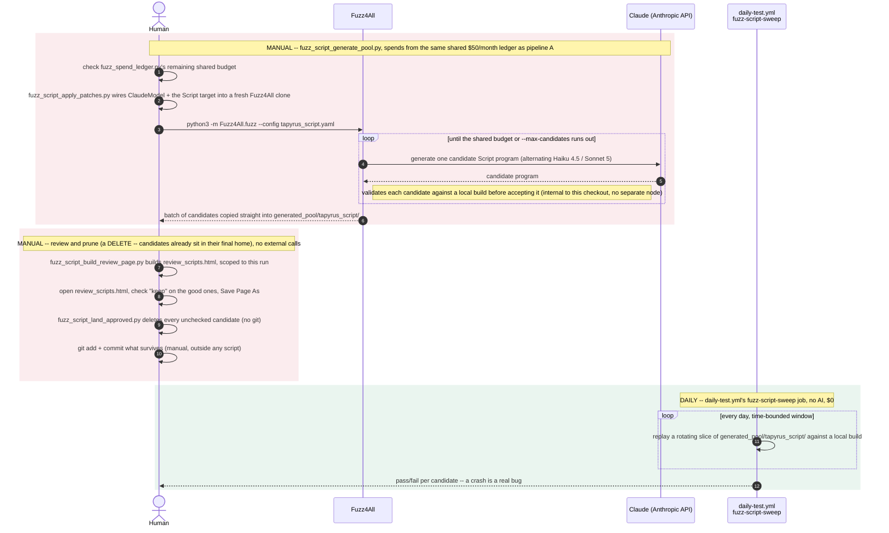

# Fuzz pipeline

Two AI-assisted pipelines grow this repo's fuzz coverage, both sharing one
$50/month budget. Every node in the diagrams below is a real external
library or service (Fuzz Introspector, OSS-Fuzz-Gen, Claude, Fuzz4All,
libFuzzer) -- no tapyrus binary or in-repo library gets its own node.
Local orchestration is drawn as the human's (or CI's) own actions,
labeled with the actual script that runs it.

Mermaid's `sequenceDiagram` grammar has no `click`/hyperlink directive
(that's a flowchart/class/state-diagram feature only -- confirmed by
trying it: `mermaid.parse()` rejects `click` inside a `sequenceDiagram`
block), so a script name inside either diagram below can't be a link. The
[Scripts at a glance](#scripts-at-a-glance) table underneath does the
same job instead: every script name there is a real relative link to
that file in this checkout.

## Pipeline A -- fuzz_code (OSS-Fuzz-Gen)

[`oss-fuzz/drafting/`](oss-fuzz/drafting/) + [`oss-fuzz/project/`](oss-fuzz/project/) + [`fuzz-introspector/`](fuzz-introspector/)

Landing a harness (the one manual, one-time step per function) is the
only place this pipeline spends money. Once it's landed, `fuzz-code-only`
runs it daily and free forever -- libFuzzer's own coverage-guided
mutation supplies different inputs every run, not a further AI call.

## Pipeline B -- fuzz_script (Fuzz4All)

[`fuzz4all/`](fuzz4all/)

No mutation engine here -- unlike pipeline A, every input this pipeline
ever tests came from an LLM call, which is exactly why the daily sweep
replays a rotating window of an already-committed pool instead of
generating anything itself.

## Scripts at a glance

| Script | Pipeline | Cadence | What it does |
| --- | --- | --- | --- |
| [`fuzz_code_run_introspector.py`](fuzz-introspector/fuzz_code_run_introspector.py) | fuzz_code | manual | Wraps oss-fuzz's own introspector command to find coverage gaps |
| [`fuzz_code_find_fuzz_gaps.py`](fuzz-introspector/fuzz_code_find_fuzz_gaps.py) | fuzz_code | manual | Parses the introspector report into a ranked candidate list |
| [`fuzz_code_generate_candidates.py`](oss-fuzz/drafting/fuzz_code_generate_candidates.py) | fuzz_code | manual | Turns each candidate into an OSS-Fuzz-Gen benchmark YAML |
| [`fuzz_code_generate_and_draft.py`](oss-fuzz/drafting/fuzz_code_generate_and_draft.py) | fuzz_code | manual | Orchestrates gap analysis through drafting and the review-page build |
| [`fuzz_code_vertex_claude_patch.py`](oss-fuzz/drafting/fuzz_code_vertex_claude_patch.py) | fuzz_code | manual | Registers a current Claude model with OSS-Fuzz-Gen's Vertex AI client (applied automatically by the script above) |
| [`fuzz_code_build_review_page.py`](oss-fuzz/drafting/fuzz_code_build_review_page.py) | fuzz_code | manual | Builds review_code.html from a run's drafted candidates |
| [`fuzz_code_land_approved.py`](oss-fuzz/drafting/fuzz_code_land_approved.py) | fuzz_code | manual | Lands (adds) the approved rows of a saved review_code.html -- no git commands |
| [`fuzz_code_select_slice.py`](fuzz_code_select_slice.py) | fuzz_code | daily | Rotates a seed slice into each libFuzzer target's corpus every run |
| [`fuzz_script_generate_pool.py`](fuzz4all/fuzz_script_generate_pool.py) | fuzz_script | manual | Orchestrates a Fuzz4All + Claude run to grow the Script candidate pool |
| [`fuzz_script_apply_patches.py`](fuzz4all/fuzz_script_apply_patches.py) | fuzz_script | manual | Wires ClaudeModel + the Script target into a fresh Fuzz4All clone (applied automatically by the script above) |
| [`fuzz_script_build_review_page.py`](fuzz4all/fuzz_script_build_review_page.py) | fuzz_script | manual | Builds review_scripts.html scoped to one run's new candidates (applied automatically by the generator above) |
| [`fuzz_script_land_approved.py`](fuzz4all/fuzz_script_land_approved.py) | fuzz_script | manual | Prunes (deletes) the unchecked rows of a saved review_scripts.html -- no git commands |
| [`fuzz_spend_ledger.py`](fuzz_spend_ledger.py) | both | shared | Tracks and enforces the one $50/month cap both generation scripts draw from |
| [`daily-test.yml`](../../.github/workflows/daily-test.yml): `fuzz-code-only` | fuzz_code | daily | Runs libFuzzer against every landed harness -- no AI |
| [`daily-test.yml`](../../.github/workflows/daily-test.yml): `fuzz-script-sweep` | fuzz_script | daily | Replays a rotating window of the committed Script pool -- no AI |

**One budget, not two.** [`fuzz_spend_ledger.py`](fuzz_spend_ledger.py)
enforces a single $50/month cap shared by both pipelines -- a heavy
fuzz_code drafting run this month leaves less for fuzz_script
generation, and vice versa. Pipeline A's spend is a real measurement
(Claude's own per-call token usage); pipeline B's is a documented
per-candidate estimate, since OSS-Fuzz-Gen is an external tool this repo
doesn't instrument internally. Both check and record against the same
state file.

**Python + asyncio, not bash.** Every orchestration script above
(`fuzz_code_run_introspector.py`, `fuzz_code_generate_and_draft.py`,
`fuzz_script_generate_pool.py`) is Python -- the three that used to be
`.sh`. Where independent work exists, it now genuinely overlaps:
`fuzz_code_generate_and_draft.py` drafts up to `--concurrency` (default
3) candidates at once instead of one at a time, and
`fuzz_script_generate_pool.py` builds `tapyrus-verify` and clones
Fuzz4All concurrently rather than sequentially. The shared budget stays
safe under concurrency because it's still checked once and spent once
per run, bracketing the concurrent work rather than being touched
inside it.

**Two review pages, opposite direction.** Both pipelines generate
content that needs a human's eyes before it's kept, but landing means
opposite things: fuzz_code's drafts start outside `src/test/fuzz/`, so
`review_code.html` approval *adds* files and wires them into the build.
fuzz_script's candidates already land straight in
`generated_pool/tapyrus_script/`, so `review_scripts.html` approval
*prunes* -- everything left unchecked gets deleted. Both default every
checkbox unchecked, and neither script runs a git command.
