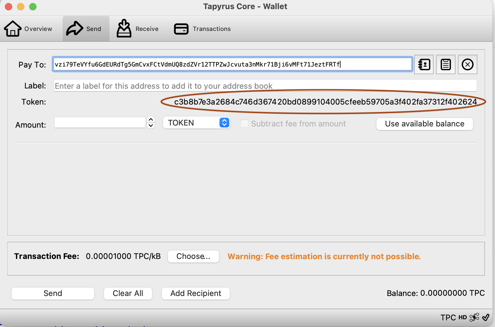

## Tapyrus core GUI

 Tapyrus GUI has been enhanced to allow Token transactions. Following are the changes made

 ### Overview Page
 Overview in the new Tapyrus GUI shows tokens as well. TPC is in view when the gui starts. _Prev_ and _Next_ buttons can be used to scroll through all the available tokens. When no other tokens are available only TPC is visible.

 

 ### Send Token
 Sending a token is the same as sending TPC except that the new address must have been generated with the colorid 

 > ./src/tapyrus-cli -conf=~/.tapyrus/ getnewaddress "NFT" c3b8b7e3a2684c746d367420bd0899104005cfeeb59705a3f402fa37312f402624
 Then the token lable would be populated automatically and "TOKEN" would be set in the token type drop down.
 
 